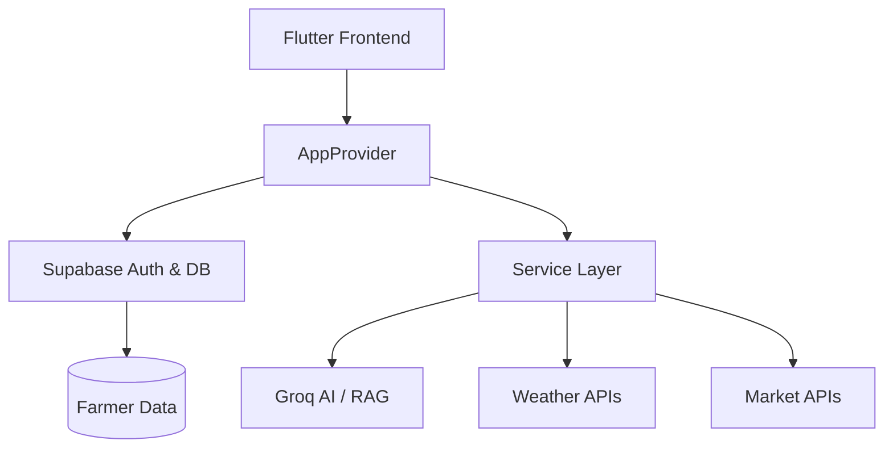

# AGROKSHA AI 🌾
**Smart Farming. Intelligent Future.**

[](https://flutter.dev)
[](https://supabase.com)
[](https://ai.meta.com/llama/)
[](https://github.com/saipradheepreddy/AGROKSHA_AI)

AGROKSHA AI is a state-of-the-art, production-ready intelligence platform designed to empower 150+ million Indian farmers. It serves as a flagship module under **SARA Ecosystems** and is a cornerstone of the **Tiranga Eco System**—a national-scale initiative for rural digital empowerment.

---

## 🌌 The Ecosystem Vision
AGROKSHA AI is part of the **SARA Ecosystems** intelligence framework, working in synergy with:
- **SARA VEDIQ**: Deep Agricultural Knowledge Base.
- **SARA LUMINA**: Digital Identity & Trust Verification.
- **Tiranga Eco System**: National-scale deployment & empowerment framework.

---

## 🚀 Key Features

### 🤖 Virtual Scientist (AI RAG)
A personalized AI scientist in the farmer's pocket. Powered by **Groq Llama-3-70B** and **Retrieval-Augmented Generation**, it provides hyper-local advice on crops, pests, and soil health.

### 📊 Mandi Pulse (Market Intel)
Real-time market tracking from 1,000+ APMC locations. Integrates with **Agmarknet** and **e-NAM** to provide the latest price trends and MSP 2026 data.

### 🆔 Digi Farm ID
A sovereign digital identity for farmers. Features a verifiable profile and secure storage for farm documents, integrated into the **LUMINA** trust network.

### 🌤 Smart Weather & Spray Engine
Hyper-local weather forecasts with a proprietary AI-driven **Spray Window** calculator to optimize pesticide and fertilizer application.

---

## 🏗 App Architecture



---

## 🛠 Setup & Installation

### Prerequisites
- Flutter SDK (>= 3.22.x)
- Supabase Project Credentials
- Groq API Key

### Configuration
1. Clone the repository.
2. Create a `.env` file in the root:
   ```env
   GROQ_API_KEY=your_key
   SUPABASE_URL=your_url
   SUPABASE_ANON_KEY=your_key
   ```
3. Generate secure environment:
   ```bash
   dart run build_runner build --delete-conflicting-outputs
   ```
4. Launch:
   ```bash
   flutter run
   ```

---

## 🌐 Supported Languages
- **English** (Primary)
- **తెలుగు (Telugu)** (Native)
- **हिन्दी (Hindi)** (Regional)

---

## 🗺 Documentation Links
- [Project Overview](./PROJECT_OVERVIEW.md)
- [Feature Breakdown](./FEATURES.md)
- [Future Roadmap](./FUTURE_ROADMAP.md)
- [Contributing Guidelines](./CONTRIBUTING.md)
- [Security Policy](./SECURITY.md)

---

## 🎯 Future Roadmap (2026-2030)
- **Phase 2**: Computer Vision diagnosis (SARA VISIONIX).
- **Phase 3**: IoT Integration & Drone scanning.
- **Phase 4**: Carbon Credit monitoring and global scaling.

---

## 🤝 Community & Support
Developed with a futuristic lens by **TEAM SARA** under **SARA Ecosystems**.

- **Website**: [saraecosystems.com](https://saraecosystems.com)
- **Contact**: contact@saraecosystems.com
- **Tiranga Initiative**: [tiranga.eco](https://tiranga.eco)

---
*Moving agriculture from a high-risk gamble to a data-driven enterprise.*
